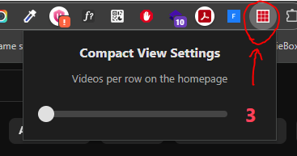

# YouTube Compact View

A browser extension that makes YouTube video thumbnails smaller to fit more videos on the screen. Enjoy a more compact and information-dense browsing experience on YouTube.

## Features

-   **Smaller Thumbnails:** Reduces the size of video thumbnails on the YouTube homepage, subscription feed, and search results.
-   **Customizable Grid:** (Future feature) Allows you to customize the number of videos per row.
-   **Simple Toggle:** Easily switch between compact and default view from the extension popup.

## Installation

### From the Chrome Web Store (Recommended)

1.  Go to the [YouTube Compact View extension page]() on the Chrome Web Store.
2.  Click on "Add to Chrome".
3.  The extension will be installed and ready to use.

### Manual Installation (for developers)

1.  Clone this repository: `git clone https://github.com/your-username/youtube-ui-small.git`
2.  Open Google Chrome and go to `chrome://extensions/`.
3.  Enable "Developer mode" in the top right corner.
4.  Click on "Load unpacked".
5.  Select the directory where you cloned the repository.

## How to Use

1.  Navigate to [YouTube](https://www.youtube.com/).
2.  Click on the extension icon in the browser toolbar.
3.  Use the toggle in the popup to enable or disable the compact view.
4.  The page will automatically refresh with the new layout.

## Contributing

Contributions are welcome! If you have any ideas, suggestions, or find a bug, please open an issue or submit a pull request.

1.  Fork the Project
2.  Create your Feature Branch (`git checkout -b feature/AmazingFeature`)
3.  Commit your Changes (`git commit -m 'Add some AmazingFeature'`)
4.  Push to the Branch (`git push origin feature/AmazingFeature`)
5.  Open a Pull Request

## License

This project is licensed under the MIT License - see the `LICENSE` file for details.

## Screenshot/Quick look

